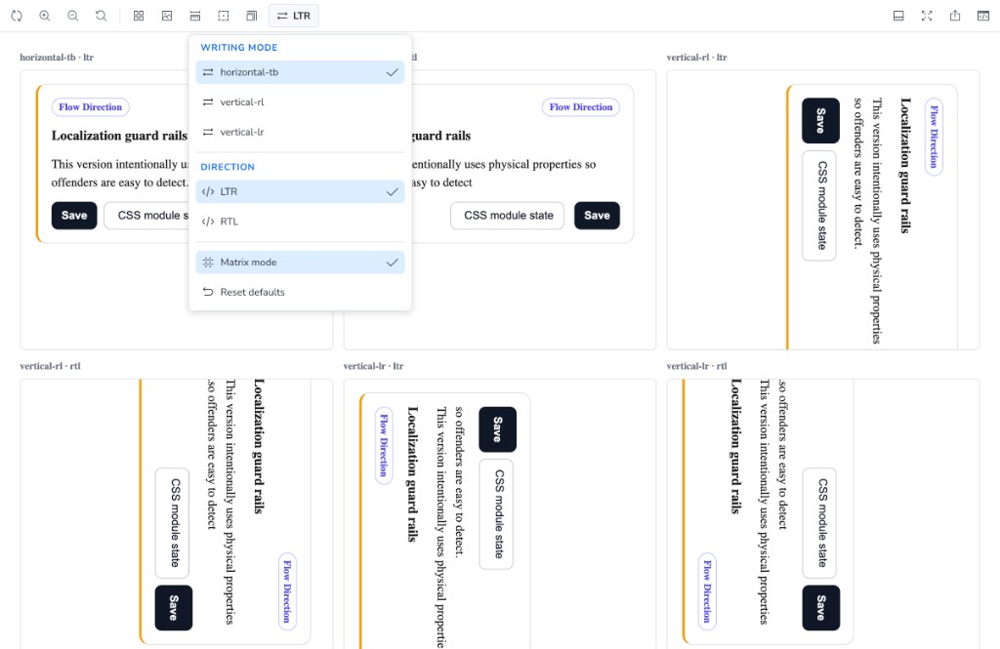
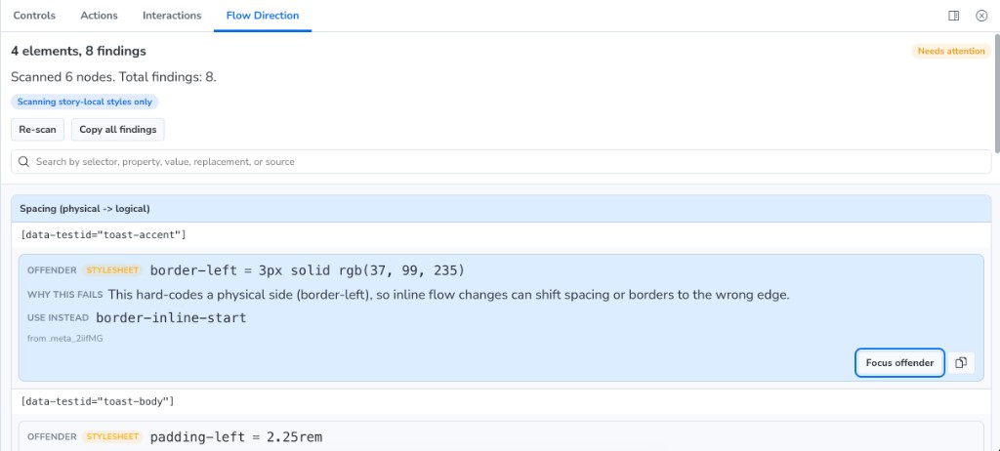

# Storybook Addon Flow Direction

Stress-test flow direction behavior in Storybook and catch physical CSS usage before it ships.

This addon helps teams validate components across writing modes, detect direction-sensitive styling issues, and migrate toward logical properties with actionable suggestions.

## Why

Most component libraries are only reviewed in `horizontal-tb + ltr`. That hides bugs that appear in:

- RTL interfaces
- vertical scripts
- mixed locale products

Flow Direction moves these checks into normal story development with:

- toolbar toggles for writing mode and direction
- optional matrix rendering for all six combinations
- source-aware scanning for physical CSS declarations
- per-finding focus to jump to offender elements

## Install

```bash
pnpm add -D storybook-addon-flow-direction
```

```bash
npm install -D storybook-addon-flow-direction
```

```bash
yarn add -D storybook-addon-flow-direction
```

## Register the addon

Add it to `.storybook/main.ts`:

```ts
import type { StorybookConfig } from '@storybook/react-vite';

const config: StorybookConfig = {
  framework: '@storybook/react-vite',
  addons: ['@storybook/addon-docs', 'storybook-addon-flow-direction'],
};

export default config;
```

## Toolbar workflow

The **Flow Direction** toolbar menu includes:

- writing mode (`horizontal-tb`, `vertical-rl`, `vertical-lr`)
- direction (`ltr`, `rtl`)
- matrix mode toggle
- reset defaults action

Use the toolbar to switch contexts, then run scans from the panel.



## Scanner scope

The scanner inspects authored styles and reports physical CSS with logical replacements.

Out of the box it targets story-local sources and includes findings from:

- stylesheet declarations readable through CSSOM
- inline `style` attributes

Examples:

- `padding-left` -> `padding-inline-start`
- `margin-right` -> `margin-inline-end`
- `left` -> `inset-inline-start` (positioned elements)
- `text-align: left` -> `text-align: start`
- `scroll-snap-type: x mandatory` -> `scroll-snap-type: inline mandatory`

Cross-origin stylesheets that block `cssRules` access are skipped.

## Panel triage flow



1. Open a `Broken/*` story.
2. Click **Re-scan** in the Flow Direction panel.
3. Review grouped findings by issue type.
4. Click **Focus offender** to jump to the element in preview.
5. Compare behavior against the matching `Working/*` story.

Current demo pairs:

- `Working/Card` and `Broken/Card`
- `Working/PricingTile` and `Broken/PricingTile`
- `Working/NavMenu` and `Broken/NavMenu`
- `Working/Toast` and `Broken/Toast`
- `Working/Drawer` and `Broken/Drawer`
- `Working/Scroll Snap` and `Broken/Scroll Snap`

## API

### Globals

- `flowDirection.writingMode`
- `flowDirection.direction`
- `flowDirection.matrix`

### Story parameters

- `flowDirection.matrix` (`boolean`) - render story as a six-cell matrix
- `flowDirection.scanScope` (optional) - customize stylesheet source matching

### Global parameters

- `flowDirection.supportedWritingModes` (`FlowWritingMode[]`) - control which writing modes appear in **both** the toolbar menu and matrix mode across the project
- `flowDirection.supportedDirections` (`FlowDirection[]`) - control which directions appear in **both** the toolbar menu and matrix mode across the project

Set this once in `.storybook/preview.ts`:

```ts
import { FLOW_DIRECTIONS, FLOW_WRITING_MODES } from 'storybook-addon-flow-direction';

const preview = {
  parameters: {
    flowDirection: {
      supportedWritingModes: [...FLOW_WRITING_MODES], // default demo setup: show all modes
      supportedDirections: [...FLOW_DIRECTIONS], // default demo setup: show both ltr + rtl
    },
  },
};
```

```ts
type ScanScopeMatch = string | RegExp;

interface FlowDirectionParameters {
  matrix?: boolean;
  supportedWritingModes?: FlowWritingMode[];
  supportedDirections?: FlowDirection[];
  scanScope?: {
    include?: ScanScopeMatch[];
    exclude?: ScanScopeMatch[];
  };
}
```

## Local development

In this addon repository, `.storybook/local-preset.ts` loads preview and manager code from TypeScript sources in `src/`, so you can run Storybook immediately after cloning without a prior `pnpm build`. External projects that depend on this package consume the bundled `dist/*` artifacts produced by `pnpm build`.

```bash
pnpm install
pnpm start
```

Quality gates:

- `pnpm lint`
- `pnpm typecheck`
- `pnpm build`
- `npm pack --dry-run`
- `pnpm prerelease`

Before publishing, also run:

- `npm whoami`
- `npm publish --access public --dry-run`

## Release policy

- We only publish from `main` after all quality gates and dry-runs pass.
- We do not publish directly from a dirty working tree.
- Every release must include an entry in `CHANGELOG.md`.
- We keep `@storybook/icons` as a peer dependency and verify Storybook compatibility before version bumps.

## Compatibility

- Storybook: `10.x`
- Node.js: `>=20.19`

## Limitations

- Scanner results depend on CSSOM readability and rendered DOM state.
- It does not perform source-file static analysis for `.css` or `.tsx`.
- It currently scans one representative matrix cell to avoid duplicate reports.
